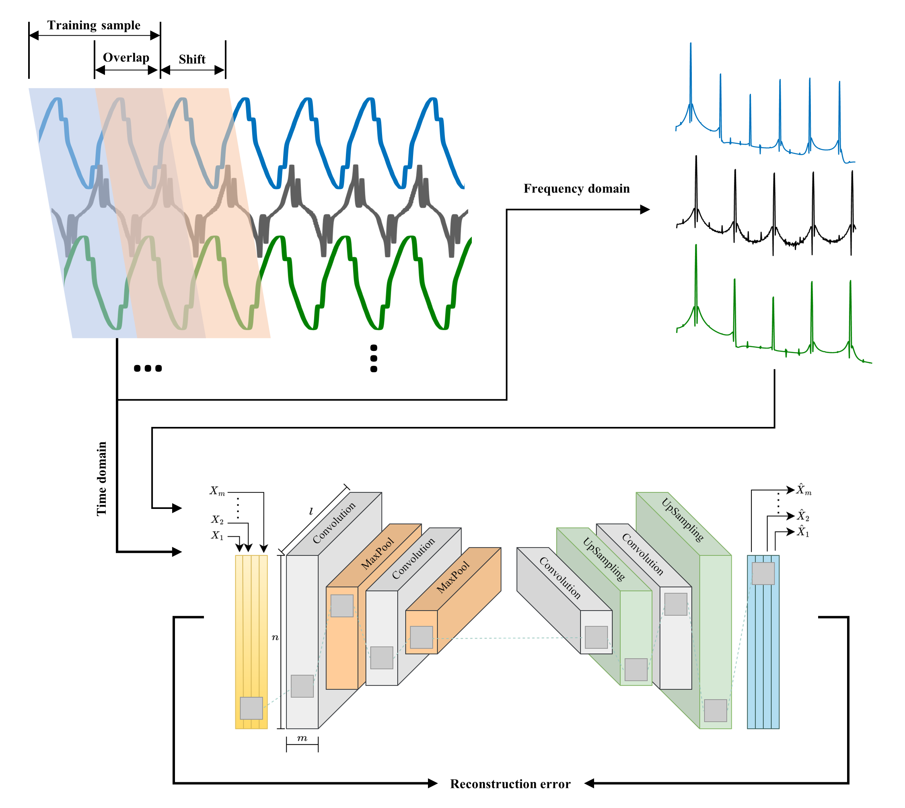

# Autoencoder-based Anomaly Detection
A deep learning framework for unsupervised anomaly detection in time series data using autoencoder architectures.

# Overview

This repository implements the unsupervised anomaly detection framework presented in:

> "Unsupervised anomaly detection of permanent-magnet offshore wind generators through electrical and electromagnetic measurements"
> Ali Dibaj, Mostafa Valavi, and Amir R. Nejad    
> Wind Energy Science, 2024  
> DOI: [https://doi.org/10.5194/wes-9-2063-2024](https://doi.org/10.5194/wes-9-2063-2024)

## Original Implementation
The initial implementation uses a convolutional autoencoder (CAE) model, as shown in Fig. 1, trained on electrical and electromagnetic time series data for anomaly detection in wind turbine permanent-magnet generators. The model is trained on normal operational data and evaluated on various fault conditions. For detailed methodology and results, please refer to the paper (we appreciate citations if you find this work useful for your research).

<p align="center">
  
  <br>
  <em>Fig. 1: Overview of data processing and CAE model architecture implemented in the paper</em>
</p>

**Note**: The dataset used in this study was simulated using proprietary software and can be made available upon request.

## Extended Framework
This repository extends the original work by implementing and evaluating additional autoencoder architectures and loss functions for time series anomaly detection.

### Implemented Architectures
- Convolutional Autoencoder (Original paper)
- Wavenet-based Autoencoder
- Attention-based Autoencoder

### Loss Functions
[To be added]


## Requirements & Installation
This project uses Poetry for dependency management. The main dependencies are:
- Python >= 3.10
- PyTorch 2.2+
- Lightning 2.1+
- NumPy
- SciPy
- Pandas
- Scikit-learn
- Librosa (for signal processing)
- Plotly & Matplotlib (for visualization)
- Hugging Face Datasets

### Installation

```bash
# Install Poetry if you haven't already
curl -sSL https://install.python-poetry.org | python3 -

# Clone the repository
git clone https://github.com/alidibaj/autoencoder-based-anomaly-detection
cd autoencoder-based-anomaly-detection

# Install dependencies using Poetry
poetry install

# Activate the virtual environment
poetry env activate
```

## License 
[License type to be added]

## Contact
[contact information]